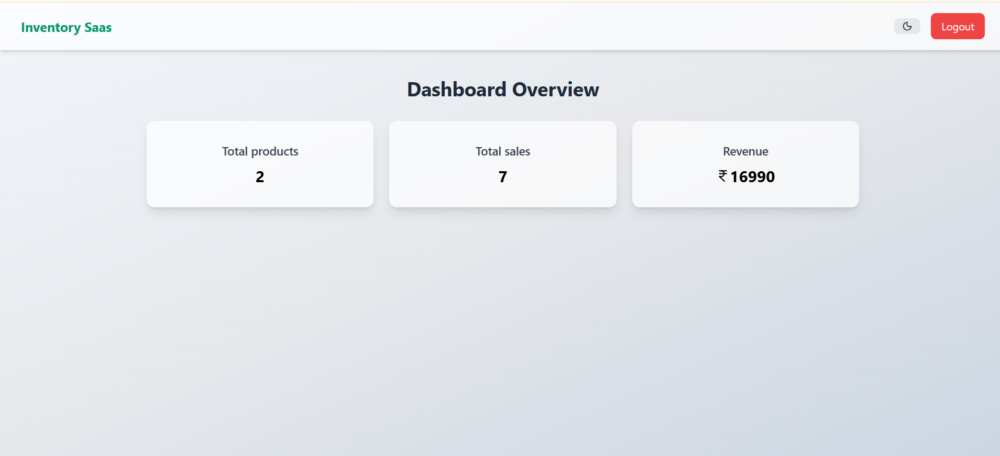
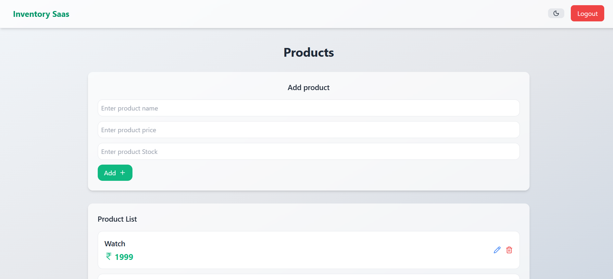
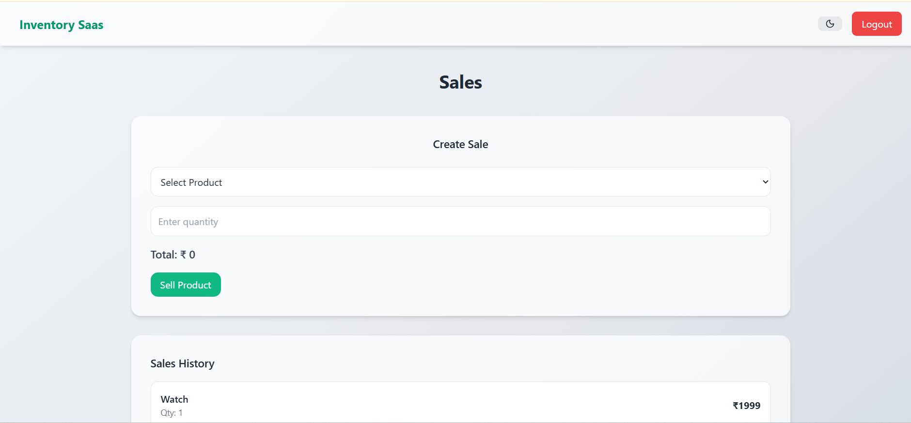
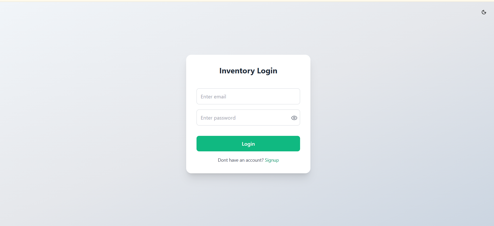
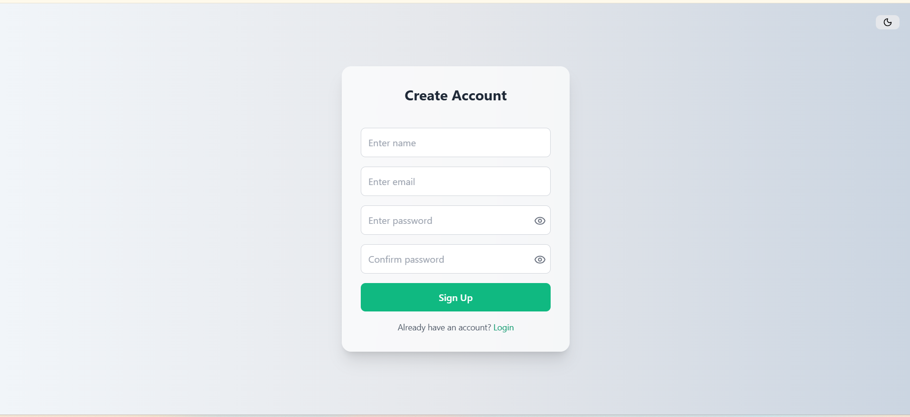

# Inventory SaaS (MERN + TypeScript)

A full-stack Inventory Management SaaS application built with a focus on real-world functionality, clean UI/UX, and production-ready deployment.

## Live Demo

https://inventory-saas.vercel.app/

## API Endpoint

https://inventory-saas-backend-ip1s.onrender.com/

## Source Code

https://github.com/sanchitaroradev/inventory-saas

## Features

- JWT-based authentication (login and signup)
- Product management (create, update, delete)
- Sales tracking system
- Dashboard analytics (revenue, total sales, total products)
- Loading skeletons for improved user experience
- Dark mode support
- Fully responsive design
- Production deployment (Vercel + Render)

## Tech Stack

### Frontend

- React (Vite)
- TypeScript
- Tailwind CSS

### Backend

- Node.js
- Express.js
- TypeScript
- MongoDB

## Key Highlights

- Built a clean and consistent SaaS-style UI
- Used TypeScript for type safety and maintainability
- Integrated REST APIs with authentication and authorization
- Implemented environment-based configuration (no hardcoded URLs)
- Handled real-world deployment issues (CORS, routing)
- Fixed SPA routing using Vercel rewrites

## Deployment

- Frontend: Vercel
- Backend: Render

## Project Structure

inventory-saas/
├── frontend/
├── backend/
├── screenshots/
├── .gitignore
├── README.md

## Screenshots

### Dashboard

### Products

### Sales

### Login

### Signup

## Learnings

- Designed and structured a full-stack application using the MERN stack
- Improved frontend development skills with React, TypeScript, and component-based architecture
- Understood API integration and state management in real-world scenarios
- Learned how to handle authentication using JWT
- Gained experience in debugging production-level issues (CORS, routing, environment variables)
- Built responsive UI with Tailwind CSS and improved UX using loading states
- Understood the importance of clean code, scalability, and maintainability
- Learned how frontend and backend communicate in deployed environments

## Author

Sanchit Arora
